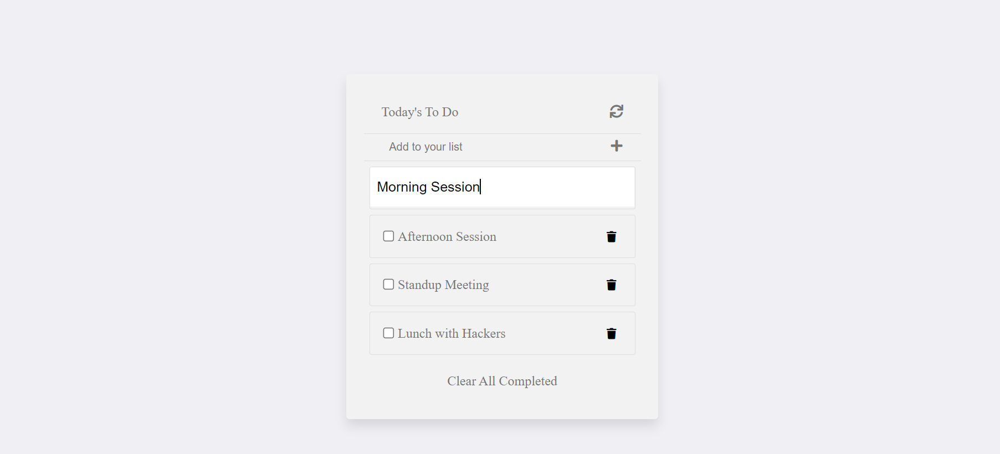

# To-Do-List App

This is my to-do list website built with html, css and JavaScript. In this project I used Webpack to bundle JavaScript and ES6 modules to write modular JavaScript. 



## Built With

- Webpack
- HTML
- CSS
- Modular JavaScript (with modern ES6 syntax)

## Live Demo

[Live Demo Link](https://mwapsam.github.io/To-Do-List/)

## Getting Started

**Setup**

git clone https://github.com/Mwapsam/To-Do-List.git

Execute the following commands on your terminal
```
npm install
npm start
```

### Prerequisites

You need to have NODE.JS set up on your local machine.


### Deployment

Execute the following commands on your terminal

```
npm run build
npm run deploy
```

It will open your browser with the project homepage


## Authors

👤 **Author**

- GitHub: [@Mwapsam](https://github.com/Mwapsam)

## 🤝 Contributing

Contributions, issues, and feature requests are welcome!

Feel free to check the [issues page](../../issues/).

## Show your support

Give a ⭐️ if you like this project!

## 📝 License

This project is [MIT](./MIT.md) licensed.
